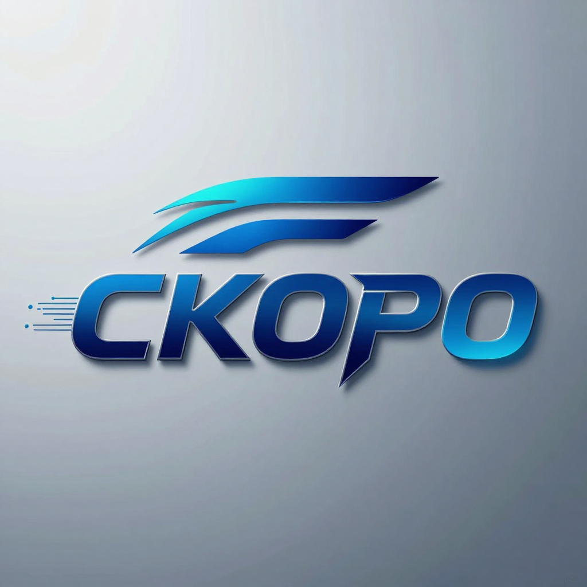

# 🗺️ [К А Р Т А](SKR/SKR__OPS.md)

<div align="center">
 <!-- <a href="izbrjn/СКОРО_НГ_1.png" style="display: inline-block;">
	
  </a>-->
  <!--<a href="izbrjn/СКОРО_НГ_2.png" style="display: inline-block;">
	
  </a>-->
  <a href="izbrjn/СКОРО_НГ_3.png" style="display: inline-block;">
	
  </a>

  
  <!-- Главный заголов -->
  <!-- <h1>С К О Р О</h1> -->
  
  <!-- Расшифровка -->
  <p><h3><b>Строй Конвейерный Оперативный Расчёт Отображения</b></h3></p>

</div>


---


## ⚡ Высокопроизводительная низкоуровневая архитектура

Высокопроизводительная низкоуровневая архитектура отображения пользовательских интерфейсов. Работает на базе RISC-V подобной регистровой виртуальной машины SKORO_RGST и графического API Vulkan (SC).

Благодаря полному отказу от классических архитектур (Chromium, Gecko, Webkit, и т.п.), обеспечивающих работу веб-браузеров (деревьев DOM, сборщиков мусора JavaScript, рантайм-движков стилизации и динамического выделения памяти в куче), **СКОРО обеспечивает выигрыш по энергоэффективности и утилизации аппаратного ускорителя вычислений (процессора/видеокарты; Вычислителя/Ускорителя) от 50% до 500% (в 1.5–6 раз).**

---


## 🚀 Пределы Приложения Строя:

Архитектура **СКОРО** разработана для применения в предсказуемых атомарных вычислительных системах, где предъявляются эталонные требования к надёжности, безопасности и энергоэффективности:

<table align="center" width="100%">
  <tr>
	<!-- Блок СТРАЖ -->
	<td align="center" valign="top" width="33%">
	  <div style="min-height: 150px; display: flex; align-items: center; justify-content: center;">
		<a href="izbrjn/СТРАЖ_НГ_1.png">
		  
		</a>
	  </div>
	  <br />
	  <p><b>СТРАЖ</b></p>
	  <div style="min-height: 40px; display: flex; align-items: center; justify-content: center;">
		<p><small><b>Система Точного Расчёта<br/>Аппаратных Жерновов</b></small></p>
	  </div>
	  <hr size="1" color="#e1e4e8" />
	  <div style="min-height: 80px; text-align: center;">
		<p><small>Бортовые комплексы и мультимедийные интерфейсы в автомобилестроении, авиации и высокоточном медицинском оборудовании.</small></p>
	  </div>
	</td>
	<!-- Блок ИСКРА -->
	<td align="center" valign="top" width="33%">
	  <div style="min-height: 150px; display: flex; align-items: center; justify-content: center;">
		<a href="izbrjn/ИСКРА_К_1.png">
		  
		</a>
	  </div>
	  <br />
	  <p><b>ИСКРА</b></p>
	  <div style="min-height: 40px; display: flex; align-items: center; justify-content: center;">
		<p><small><b>Исполнительные Системы<br/>Кроткого Расхода Аппарата</b></small></p>
	  </div>
	  <hr size="1" color="#e1e4e8" />
	  <div style="min-height: 80px; text-align: center;">
		<p><small>Изделия, работающие от аккумуляторов, резервных батарей или бортовых сетей.</small></p>
	  </div>
	</td>
	<!-- Блок КЛЮЧ -->
	<td align="center" valign="top" width="33%">
	  <div style="min-height: 150px; display: flex; align-items: center; justify-content: center;">
		<a href="izbrjn/КЛЮЧ_З_1.png">
		  
		</a>
	  </div>
	  <br />
	  <p><b>КЛЮЧ</b></p>
	  <div style="min-height: 40px; display: flex; align-items: center; justify-content: center;">
		<p><small><b>Ковчег Любимой<br/>Юти Человека</b></small></p>
	  </div>
	  <hr size="1" color="#e1e4e8" />
	  <div style="min-height: 80px; text-align: center;">
		<p><small>Изделия обеспечения контроля доступа, шифрования и аппаратной защиты пользователя, с абсолютным обеспечением программной безопасности.</small></p>
	  </div>
	</td>
  </tr>
</table>

---


## 💎 Инженерная философия: Линейная Опись Безопасного Алгоритма против веб-рантайма

Традиционные UI-фреймворки (HTML/CSS, Android XML, Flutter, Qt) во время работы программы создают в памяти тяжелое динамическое дерево объектов. Каждый узел — это отдельный объект в куче (Heap), что приводит к тотальной фрагментации памяти и высокому потреблению энергии.

**СКОРО полностью меняет эту парадигму:**

---


## 📐 Архитектурный Манифест СКОРО

* **Линейная Опись (Нулевой уровень размета):** Человекочитаемая форма представления Безопасного Алгоритма преобразуется в многоуровневую зонно-линейную машиночитаемую форму Описи Безопасного Алгоритма.
* **Нулевой оверхед в рантайме:** Вложенные области видимости (`[...]`) не создают новых динамических блоков памяти. Элементы абсолютно всех уровней живут обособленно и равноправно в едином линейном пуле общей части.
* **Математическая иерархия на линиях смещений:** Для каждого элемента, имеющего дочерние элементы, выделяется местная часть линии учёта смещений дочерних элементов. Иерархическая вложенность полностью разрешается Интерпретатором в физические смещения памяти (`Базовый адрес + Смещение`) еще на этапе первого прохода. Архитектура опирается на аппаратную арифметику указателей и управление логической памятью, а не на поиске строк или хэш-таблицах.
* **Абсолютная адресация нулевого уровня:** Каждый элемент на нулевом уровне описи обязан иметь уникальный код (ELMNT_K) для обеспечения возможности доступа к элементам при их связывании и инициализации Отображения Интерпретатором.

---


## 📊 Особенности, влияющие на производительность и энергоэффективность

По сравнению с традиционными ООП/HTML/CSS фреймворками, **СКОРО** оптимизирует физическое потребление вашего аппаратного слоя в трех основных режимах работы:


### 1. Постоянный режим (Экран без изменений) → Исключение фоновых операций &rarr; **Экономия энергии до 500%+**
*   **В традиционных веб-оболочках (Chromium / WebView):** Даже если пользователь не взаимодействует с экраном, браузерный движок непрерывно расходует ресурсы CPU. В рантайме JavaScript циклически запускаются потоки сбора мусора (Garbage Collection), работают фоновые потоки JIT-оптимизации, а таймеры разметки продолжают опрашивать и перестраивать DOM-дерево. Вычислитель не может перейти в глубокие энергосберегающие состояния (C-states), так как постоянно прерывается фоновым оверхедом. Движок вынужден выполнять поиск целевого элемента по иерархическому дереву DOM, динамически пересчитывать CSS-стили (Layout Reflow) и заново формировать слои отрисовки (Repaint). Это вызывает массовые промахи кэша Вычислителя и амплитудные выпады его тактовой частоты. Вычислитель резко изменяя тактовую частоту и выжигает батарею.
*   **В архитектуре СКОРО:** Интерфейс детерминирован и предсказуем. Когда Отображение постоянно, Линейная Опись обработана и финальное состояние передано в конвейер Ускорителя, выполнение кода в Вычислителе прекращается. Вычислитель переходит в режим ожидания аппаратного прерывания (`Idle`; `WFI` — Wait For Interrupt в архитектуре RISC-V), снижая энергопотребление на уровне кристалла чипа практически до нуля. Батарея тратится только на подсветку экрана.


### 2. Переменный Режим (Ввод и события) → Изоляция и атомарность &rarr; **Снижение нагрузки на CPU от 100% до 300%**
* **В Web:** Любое событие ввода инициирует тяжелый каскад пересчета: парсинг событий ввода &rarr; динамический пересчет стилей (Layout Reflow) &rarr; перестроение дерева DOM &rarr; вызовы графического конвейера. Движок вынужден выполнять поиск целевого элемента по иерархическому дереву DOM, динамически пересчитывать CSS-стили (Layout Reflow) и заново формировать слои отрисовки (Repaint). Это вызывает массовые промахи кэша Вычислителя и амплидутные выпады его тактовой частоты. Вычислитель резко изменяя тактовую частоту и выжигает батарею.
* **В СКОРО:** В традиционных архитектурах любое событие ввода вызывает лавинообразный рекурсивный каскад (Layout Reflow / Repaint), заставляя железо резко задирать частоты для перерасчета дерева стилей. **СКОРО** полностью меняет эту парадигму, аппаратно изолируя логику поведения от графического конвейера:


#### А. Изоляция Ввода и Поведения (Интерпретатор Описи на Вычислителе)
*   Курсор аппаратно изолированы и не влияют на особенности Отображения других слоёв.
*   Алгоритм **Hit-Testing** (определение элемента под курсором) выполняется за минимальное количество инструкций Вычислителя, так как элементы всех уровней размещаются в многоуровневой зонно-линейной Описи. При событии по инертному элементу (`K_S_SKORO__STN__RZM_FLG__INRT == 0`), итератор мгновенно отбрасывает это событие.
*   Изменения состояний, условная логика и динамические смещения элементов обрабатываются компактные скомпилированные последовательности байт-кода безопасного алгоритма (`БА`; `@algrtm`) RISC-V подобной регистровой виртуальной машины `SKORO-RGST`. 
*   Физические изменения геометрии рассчитываются за один проход (**Single-Pass Layout**) посредством Вычислителя, который тратит такты только на полезные математические смещения указателей (`add`, `ld`), не перегружая шину памяти. Все расчеты завершаются за микросекунды, и Вычислитель мгновенно засыпает обратно в режим `Idle` (`WFI`).


#### Б. Однопроходная Геометрия (VLIW-Архитектура Данных на Ускорителе)
*   После Подготова Схем Отображения в результате расчётов Вычислителя, они передаются на формирование Отображения в Ускоритель. Схемы построены по принципу **VLIW-архитектуры данных**, где геометрические параметры, допуски и режимы отображения упакованы в однородные структуры Схем Отображения.
*   Конвейер Ускорителя за **один проход (Single-Pass Layout)** параллельно обрабатывает VLIW-блоки данных.
*   При переходе в режимы Свободного размещения (`SVBD`) и Позиционного размещения (`PZC`), предельные размеры дочерних элементов строго ограничены предельными размерами старшего элемента. Это обеспечивает предсказуемое определение позиций элементов и безопасность для человека, за счет исключения неявных наложений элементов, и гарантирует абсолютно предсказуемое определение позиций всех элементов интерфейса на экране, полностью исключая обратный каскад избыточных повторных вычислений.


### 3. Режим тяжелой графики (Максимальная нагрузка через Vulkan SC) &rarr; **Экономия минимум 50% ресурсов GPU и шины памяти**
* **В Web:** Тяжелые объектно-ориентированные графические библиотеки постоянно выделяют и освобождают буферы памяти в рантайме, а динамические драйверы непрерывно гоняют проверки валидации конвейера.
* **В СКОРО:** Благодаря использованию Vulkan SC (`Safety Critical`), обеспечено: исключение избыточного контроля; предсказуемые однократное выделение памяти, а технические алгоритмы отображения заранее скомпилированы в исполняемый код Ускорителя (`SPIR-V`). Это убирает любую паразитарную работу Вычислителя и Ускорителя при работе с Единым Оперативным Запоминающим Устройством.


---

## 🛠️ Полная симметричная архитектура синтаксиса

Разбор Описи Безопасного Алгоритма **СКОРО** работает как абсолютно симметричный, идемпотентный алгоритм двунаправленного преобразования форм. Машиночитаемая форма, может быть декомпилирована обратно в Человекочитаемую форму, без семантических потерь и искажений структуры первоначальной Человекочитаемой формы.


### Опись Безопасного Алгоритм Содержит Следующие Группы:

| № | Токен | Группа Описи | Краткое функциональное назначение |
| :-: | :-: | :--- | :--- |
| **1** | `@svz` | Связи | Описание символических и физических связей глобальных Вставляемых (`$`) и Указательных (`&`) параметров. |
| **2** | `@prm` | Параметры | Описание статических значений и конфигурационных констант Вставляемых (`$`) и Указательных (`&`) параметров. |
| **3** | `@tm` | Темы | Статическое переопределение цветовых токенов для бесшовной смены палитр (скинов) с нулевым оверхедом. |
| **4** | `@ustrv` | Устройства | Описание Режимов Устройств, состоящих из условных свойств Устройств и связанных с ними Параметров. |
| **5** | `@obrz` | Образы | Описание свойств Образов Элементов. |
| **6** | `@elmnt` | Элементы | Описание свойств Элементов. |
| **7** | `@algrtm`| Алгоритмы | Описание последовательности логических инструкций, условных переходов, функций и вызовов внешних функций `SKORO-RGST`. |

---


### 1. С В Я З И (`@svz`)
Пример Описи Группы **Связи**
Включение отложено до изготова системы безопасности DI_OS
```text
@svz {
	И З О Б Р Е Т А Е Т С Я
}
```


### 2. П А Р А М Е Т Р Ы (`@prm`)
*   Параметры могут применяться в группах Описи: `@prm`, `@tm`, `@ustrv`, `@obrz`, `@elmnt`, `@algrtm`.
*   Вставляемые Параметры применяются для описания неоперативно изменяющихся значений. Вставляемые Параметры пересчитываются автоматически при смене Темы, Устройства или непосредственным вызовом соответствующих функций.
*   Указательные Параметры применяются для описания оперативно изменяющихся значений. Указательные Параметры пересчитываются при каждом обращении к ним (например, при изменении размеров или позиции элемента, при возникновении события, использования в алгоритме).

Пример Описи Группы **Параметры**:
```text
@prm {
	$prm_8       : 0777              // Задание Значения Вставляемого Параметра в Форме Целого Числа (Восьмеричного)
	&ukz_10      : 1000              // Задание Значения Указательного Параметра в Форме Целого Числа (Десятичного)
	$prm_drbn    : 1.5               // Задание Значения Вставляемого Параметра в Форме Дробного Числа
	&pnl_9rkst   : 0x010101FF        // Задание Значения Указательного Параметра в Форме Целого Числа (Шестнадцатеричного)
	$cvt_base    : 0x0370777F        // Задание Значения Вставляемого Параметра в Форме Целого Числа (Шестнадцатеричного)
	&user_cvt    : 0x0370777F        // Задание Значения Указательного Параметра в Форме Целого Числа (Шестнадцатеричного) (Повторяет Значение Варианта $cvt_base)
	$cvt_dop1    : 0xA370777F        // Задание Значения Вставляемого Параметра в Форме Целого Числа (Шестнадцатеричного)

	$mrgn_1      : [10, 10, 10, 10]  // Задание Значения Вставляемого Параметра в Форме Целого Вектора-4 (Череды Целых Чисел)

	// --- Связывания Значений Параметров ---
	$mrgn_2      : $mrgn_1           		// Связывание Параметра с Вставляемым Параметром
	$prm_1       : $cvt_base        		// Связывание Параметра с Вставляемым Параметром
	$prm_2       : &user_cvt         		// Связывание Параметра с Указательным Параметром

	$prm_3       : @prm.$cvt_base   		// Связывание Параметра с Параметром
	$prm_4       : @prm.&user_cvt    		// Связывание Параметра с Параметром
	$tm_1        : @tm.tm_1         		// Связывание Параметра с Темы
	$ustrv_1     : @ustrv.vrnt_1    		// Связывание Параметра с Устройством
	$obrz_1      : @obrz.main_viewport  	// Связывание Параметра с Образом
	$obrz_2      : @obrz.main_viewport2		// Связывание Параметра с Образом
	$elmnt_1     : @elmnt.viewport   		// Связывание Параметра с Элементом (по Коду Элемента)
	$elmnt_2     : @elmnt.elmnt_svz_1		// Связывание Параметра с Элементом (по Коду Элемента)

	// --- Задание Значений в Форме Текстовых Строк ---
	$str_1       : "строка1"         // Задание Значения Вставляемого Параметра в Форме Короткой Строки
	$str_2       : "строка12213 2"   // Задание Значения Вставляемого Параметра в Форме Длинной Строки
	$str_3       : "строка12213 2"   // Задание Значения Вставляемого Параметра в Форме Длинной Строки (Повторяет Значение Варианта $str_2)

	// --- Задание Значений в Форме Вложенных Составных Структур ---
	$rzm_4_1     : {                 // Задание Значения Вставляемого Параметра в Форме Составного Блока Размера
		rzm_h   : NZ
		rzm_v   : STRH

		rzm_h_0 : STRH
		rzm_h_1 : NZ
		rzm_v_0 : NZ
		rzm_v_1 : NZ
	}
}//*/
```


### 3. Т Е М Ы (`@tm`)
Группа **Темы** используется для эффективного неоперативного изменения Всталяемых Параметров и Указательных Параметров Отображения посредством вызова внешних функций `SKORO-RGST`.

Пример Описи Группы **Темы**
```text
@tm {
	tm_1 (
		$cvt_base : #015055FF
		$cvt_dop  : #825055FF
	)
	tm_2 (
		$cvt_base : #012022FF
		$cvt_dop  : #821011FF
	)
}
```


### 4. У С Т Р О Й С Т В А (`@ustrv`)
Группа **Устройства** Используется для условного неоперативного изменения Всталяемых Параметров и Указательных Параметров Отображения, выполняемого при изменении параметров Устройства Отображения.

Пример Описи Группы **Устройства**
```text
@ustrv {
	ustrv_1 (
		s_okn_rzm: {			// Структура Условных Параметров Размеров Окна Устройства
			okn_rzm_h: ?>100	// Условный Параметр Ширины Устройства [Строго больше 100]
			okn_rzm_v: ?==80	// Условный Параметр Высоты Устройства [Равно 100]
		}
	) {
		$shrft_rzm : 14
		$zglv_vst		: 80
	}

	vrnt_2 (
		s_okn_rzm: {
			okn_rzm_h: ?<200	// Условный Параметр Ширины Устройства [Строго меньше 200]
			okn_rzm_v: ?!=40	// Условный Параметр Высоты Устройства [Не равно 40]
		}
	) {
		$shrft_rzm : 16
		$zglv_vst		: 60
	}
}
```


### 5. О Б Р А З Ы (`@obrz`)
*   Группа **Образы** используется для эффективного описания основных и дополнительных свойств элементов посредством Образов.
*   Образ может непосредственно наследовать свойства старшего образа, который указан в его соответствующем свойстве (`obrz_strh`). При наследовании действуют следующие правила приоритета:
	1.  **Свойства Образа** обладают наивысшим приоритетом и безусловно переопределяют любые унаследованные параметры.
	2.  **Свойства Старшего Образа (`obrz_strh`)** применяются «лениво» и выступают в качестве базовых значений только для неописанных полей Образа.
*   В Образе обязательно требуется описание всех основных свойств Образа посредством прямой описи или наследования.

Пример Описи Группы **Образы**
```text
@obrz {

	main_viewport (
		// 1. Параметры Состояния (s_stn)
		s_stn: {
			rzm_frm:	SHRK
			rzm_pzc:	PZC
			rzm_pkz:	VDM_1
			rzm_prln: OGRN
			rzm_flg:	(VDL | INRT | RM)
			krs_t:	UKZ
		}

		// 2. Размерные Параметры (s_rzm)
		s_rzm: {
			rzm_h: 100
			rzm_v: 80

			rzm_h_0: NZ
			rzm_h_1: NZ
			rzm_v_0: NZ
			rzm_v_1: NZ
		}

		// 3. Граничные Параметры (s_grnc)
		s_grnc: {
			tlschn_vrhn: 2
			tlschn_prv: 1
			tlschn_nj: 4
			tlschn_lv: 1

			krg_vrhn: 0
			krg_prv: 5
			krg_nj: 0
			krg_lv: 0

			cvt_vrhn: #FF5733
			cvt_prv: #FF5733
			//cvt_prv: &cvt_osn
			cvt_nj: 0xFF0000FF
			cvt_lv: #FF5733
			//cvt_lv: &cvt_osn
		}

		// 4. Позиционные Параметры (s_pzc)
		s_pzc: {
			pzc_rvn: (PRV, NJ)
			pzc_h: 45
			pzc_v: 150
			pzc_glbn: 100
		}

		// 5. Внешние Отступы (s_otsp_1)
		s_otsp_1:	[10, 5, 6, 8]	// top, right, bottom, left

		// 6. Внутренние Отступы (s_otsp_0)
		s_otsp_0: [25, 35, 45, 15]

		// 7. Шрифтовые Параметры (s_shrft)
		s_shrft: {
			//shrft_rzm: $shrft_rzm
			shrft_rzm: 24
			shrft_vst: 1.0
			shrft_otsp_v: 1
			shrft_otsp_h: 1
			shrft_tlschn: 4
			shrft_rvn: SRDN
		}

		// 8. Цветовые Параметры (s_cvt)
		s_cvt: {
			//cvt_osn:		&cvt_osn
			cvt_osn:		0xFF0000FF
			//cvt_fn:		$cvt_base
			cvt_fn:		#FF5733
			cvt_shrft: #FF5733
			pltns:		255
		}
	)

	main_viewport2 (

		obrz_strh: main_viewport
		s_stn: {
			rzm_frm:	SHRK
			rzm_pzc:	PZC
			rzm_pkz:	VDM_1
			rzm_prln: OGRN
			rzm_flg:	(VDL | INRT | RM)
			krs_t:	UKZ
		}
	)

	main_viewport3 (

		obrz_strh: main_viewport2
	)//*/
}
```


### 6. Э Л Е М Е Н Т Ы (`@elmnt`)
*   Группа **Элементы** используется для эффективного описания структуры Отображения и его элементов;
*   Элемент может содержать код (`elmnt_k`) для обеспечения возможности глобального доступа к Элементу и его связываний со структурой Отображения посредством вызова внешних функций `SKORO-RGST`;
*   Элемент может непосредственно наследовать свойства Образа, который указан в его соответствующем свойстве (`elmnt_obrz`);
*   Элемент может непосредственно наследовать свойства Образа, который указан в соответствующем свойстве (`elmnt_obrz_mldsh`) его старшего Элемента;
*  При наследовании действует правило приоритета:
	1.  **Свойства Элемента (`elmnt_osn_prm`)** обладают наивысшим приоритетом и безусловно переопределяют любые унаследованные параметры.
	2.  **Свойства Образа (`elmnt_obrz`)** применяются «лениво» и выступают в качестве базовых значений только для неописанных полей Элемента.
	3.  **Свойства Передаваемого Образа Младшим Элементом Старшего Элемента (`elmnt_obrz_mldsh`)** применяются «лениво» и выступают в качестве базовых значений только для неописанных полей Элемента.
*   В Элементе обязательно требуется описание всех основных свойств Элементе посредством прямой описи или наследования из Образов.
*   Элемент может описаться в списке дочерних элементов указательно (`.elmnt_svz_1`).

Пример Описи Группы **Элементы**
```text
@elmnt {

	krb:elmnt_svz_1 (
		//elmnt_obrz: main_viewport
		//elmnt_obrz: main_viewport2
		elmnt_obrz: main_viewport
	)

	krb:viewport (
		elmnt_obrz: main_viewport
		elmnt_osn_prm: {
			s_stn: {
				rzm_frm:	PRSK
				rzm_pzc:	CHRD
				rzm_pkz:	VDM_1
				rzm_prln: AVTM
				rzm_flg:	(VDL | INRT)
				krs_t:	STRL
			}
		}
		elmnt_obrz_mldsh: main_viewport2
		[
			krb:viewport2 (
				elmnt_obrz_mldsh: main_viewport2
				elmnt_osn_prm: {
					s_rzm: {
						rzm_h: 100
						rzm_v: 80

						rzm_h_0: NZ
						rzm_h_1: NZ
						rzm_v_0: NZ
						rzm_v_1: NZ
					}
				}
			)
			// Верхняя навигационная панель
			krb:top_nav1 (
				//elmnt_obrz: panel_header
				elmnt_obrz: main_viewport
			)
			.elmnt_svz_1
			krb (
				elmnt_osn_prm: {
					s_stn: {
						rzm_frm:	PRSK
						rzm_pzc:	CHRD
						rzm_pkz:	VDM_1
						rzm_prln: AVTM
						rzm_flg:	(VDL | INRT)
						krs_t:	UKZ
					}
				}
			)
			krb ()
			krb (
				elmnt_osn_prm: {
					s_rzm: {
						rzm_h: 200
						rzm_v: 40

						rzm_h_0: NZ
						rzm_h_1: NZ
						rzm_v_0: NZ
						rzm_v_1: NZ
					}
				}
			)
			krb:top_nav2 (
				elmnt_obrz: main_viewport
			)
			krb ()
		]
	)//*/

		// ДОПУСКАЕТСЯ ПОЗДНЕЕ ОПИСАНИЕ ЭЛЕМЕНТОВ, ДОСТУП К КОТОРЫМ ОСУЩЕСТВЛЯЕТСЯ ПО УКАЗАТЕЛЮ
	/*krb (
		elmnt_k: elmnt_svz_1
		elmnt_obrz: main_viewport
	)*/
	// ДОПУСКАЕТСЯ ПОЗДНЕЕ ОПИСАНИЕ ЭЛЕМЕНТОВ, ДОСТУП К КОТОРЫМ ОСУЩЕСТВЛЯЕТСЯ ПО УКАЗАТЕЛЮ. Конец


		// ПРИМЕР ОШИБА ПОВТОРА КОДА ЭЛЕМЕНТОВ
	/*krb (
		elmnt_k: viewport3
		elmnt_obrz: main_viewport
	)
	krb (
		elmnt_k: viewport3
		elmnt_obrz: main_viewport
	)*/
	// ПРИМЕР ОШИБА ПОВТОРА КОДА ЭЛЕМЕНТОВ. Конец
}//*/
```


### 7. Алгоритмы (`@algrtm`)
Пример Описи Группы **Алгоритмы**
```text
@algrtm {
	И З О Б Р Е Т А Е Т С Я
}
```


---


💡 **Полезная информация:** Для ознакомления с синтаксисом архитектуры языка СКОРО и удобной подсветки кода доступно официальное расширение для VS Code: [vscode_ext/di_skr-1.0.0/](vscode_ext/di_skr-1.0.0/). 

Расширение также поддерживает экспорт размеченного кода в формат HTML. Примеры подсветки и синтаксиса в экспортируемом виде размещены в Разделе `Приклады` [prkld/](prkld/).

---
